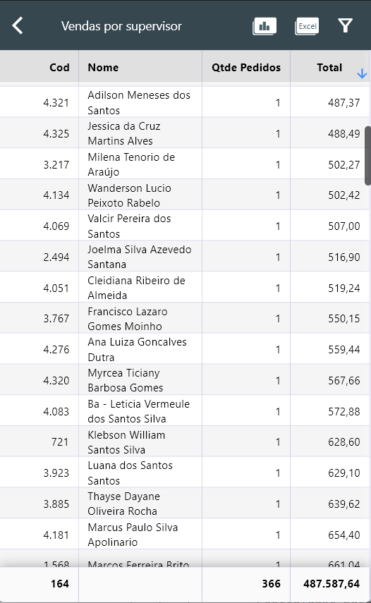
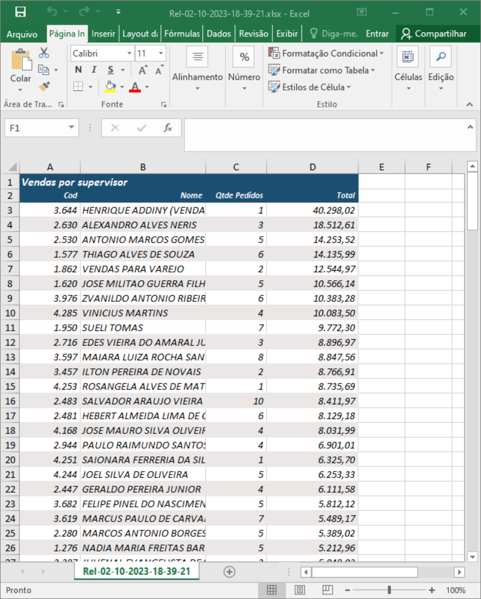

# Package Reports
Package de criação de relatórios automaticamente a partir de uma entrada de JSON
- Principais funções:
  - Relatório com totalizadores e ordenação
  - Gráficos (Barras, pizza, ...)
  - Exportação para excel

## Getting Started

- Entre no arquivo pubspec.yaml
- Adicione isto ao arquivo pubspec.yaml do seu pacote:
``` Dart
dependencies:
     package_reports: ^0.0.3
```
- Get dependencies

``` shell
flutter pub get
```


## Exemplo de API para gerar JSON de entrada para o PACKAGE REPORTS

- Exemplo que como escrever uma query na API no back-end:
```php
<?php
    include_once "../header.php";
        
    if ($_SERVER['REQUEST_METHOD'] === 'POST') {
        $inputJSON = file_get_contents('php://input');
        $data = json_decode($inputJSON);
        if ($data === null) {
            http_response_code(400);
            echo json_encode(["error" => "Erro ao decodificar o JSON de entrada."]);
            exit;
        }

        // FAZER VERIFICAÇÕES DE ENTRADA DE CADA FILTRO
        if (!isset($data->data_inicio) || !isset($data->data_fim) || !isset($data->banco)) {
            http_response_code(400);
            echo json_encode(["error" => "Os campos 'data_inicio' e 'data_fim' são obrigatórios."]);
            exit;
        }
    } else {
        http_response_code(405);
        echo json_encode(["error" => "Método não permitido. Use POST para enviar os dados JSON."]);
        exit;
    }

    $sql =  "select 
                  pcpedc.codusur as cod__INT__NO_METRICS
                , pcusuari.nome
                , count(*) qtde_pedidos__INT
                , sum(pcpedc.vlatend) as total
            from pcpedc, pcusuari
            where pcpedc.codusur = pcusuari.codusur
            and data between to_date('$data->data_inicio', 'DD/MM/YYYY') and to_date('$data->data_fim', 'DD/MM/YYYY')
            group by pcpedc.codusur, pcusuari.nome
            order by total desc";

    $db = instancia_DB($data->banco);
    $result = $db->select($sql);

    http_response_code(200);
    echo json_encode($result);
    exit;
```

### exemplo de resquisição da API no Insonia:


### Saída JSON da query:
```json
    [
      {"COD__INT__NO_METRICS":"4321","NOME":"ADIL MENESES DOS SANTOS","QTDE_PEDIDOS__INT":"1","TOTAL":"487.37"},
      {"COD__INT__NO_METRICS":"2940","NOME":"ADMILTON MOREIRA SOUZA","QTDE_PEDIDOS__INT":"3","TOTAL":"1486.18"},
      {"COD__INT__NO_METRICS":"4318","NOME":"LUIZ FERRAZ DOS SANTOS","QTDE_PEDIDOS__INT":"1","TOTAL":"940.4"},
      {"COD__INT__NO_METRICS":"4307","NOME":"AGATINE OFLIA DE OLIVEIRA","QTDE_PEDIDOS__INT":"1","TOTAL":"1826.08"},
      {"COD__INT__NO_METRICS":"2","NOME":"FERREIRA DE OLIVEIRA","QTDE_PEDIDOS__INT":"3","TOTAL":"2802.86"}
    ]
```

- Tags permitidas para adição no alises da query
```dart
    /*
      Forma de realizar formatação de dados e alinhamento em tela.
      Deve-se enviar a seguinte informação no final de cada nome de coluna na query, sendo maíusculo ou minúsculo:

      __int_string    => para forçar numero ser tratado e alinhado como string
      __string        => forçar o uso de String
      __double        => forçar uso de double
      __int           => forçar uso de int
      __no_metrics    => excluir da exibição de metricas dos graficos
      __nochartarea   => excluir do grafico de area e line
      __invisible     => não exibir campo no relatório
      __dontsum       => não somar na barra de totalizador
      __perc          => colocar % (percentagem) junto ao texto da coluna
      __freeze        => congelar coluna ao deslizar barra de scroll horizontal
      __sizew         => passar largura fixa de coluna. Exemplo: __sizew30

      IMPORTANTE:
      - Caso o tipo de dado não seja informado através de uma tag especificada acima,
        o tipo de formatação será determinado a partir dos dados recebidos.
    */
```

### Relatório de saída:


### Relatório de saída - Gráficos:


### Relatório de saída - Exporte para Excel:



## Estrutura do package_reports
``` shell
lib-|
    |-- package_reports.dart 
    |       - Contém todos os exports permitidos para uso nos projetos que irão consumir o package
    |
    |-- report_module
    |   |
    |   |-- charts
    |   |   |-- chart_data.dart
    |   |   |       - ChartData (class de dados padrão que todos os graficos vão consumir)
    |   |   |       - ColorData (class com todas as cores para consumo randômico nos gráficos)
    |   |   '-- charts.dart
    |   |           - Widget de gráficos
    |   |
    |   |-- controller
    |   |   |-- layout_controller.dart
    |   |   |       - Controlador de largura, altura e tipo de tela (mobile, desktop)
    |   |   |-- report_chart_controller.dart
    |   |   |       - Controlador para construção de gráficos do relatório, keys com valores do tipo String será identificado com métricas e tipo int, double, será definido como valores dos gráficos
    |   |   |-- report_from_json_controller.dart
    |   |   |       - CONTROLADOR PRINCIPAL que irá receber o JSON de entrada para construção do relatório, todas as keys do JSON será interpretado como nome de coluna e todos os values das respectivas keys como rows de dados 
    |   |   '-- report_to_xlsx_controller.dart
    |   |   |       - Controlador para exportar dados para Excel
    |   |   '-- filtros_controller.dart
    |   |           - Controlador de filtros
    |   |
    |   |-- core
    |   |   |-- api_consumer.dart
    |   |   |       - Arquivo responsável pelo consumo de API que irá fornecer os dados em formato JSON para construção do relatório
    |   |   |-- features.dart
    |   |   |       - rercusos de uso privado no package (funções de formatação, etc)
    |   |   '-- settings.dart
    |   |           - variveis static global como link de api, etc
    |   |
    |   |-- model
    |   |   '-- my_icon_data.dart (442 KB)
    |   |
    |   |-- page
    |   |   |-- filtros_report_page.dart
    |   |   |       - Tela de filtros
    |   |   |-- report_chart_page.dart
    |   |   |       - Tela de gráficos
    |   |   |-- report_page.dart
    |   |   |       - Página de relatórios 
    |   |   '-- filtros_page.dart
    |   |           - class de conversão do filtro antigo do sistema analytics para atual
    |   |
    |   '-- widget
    |       |-- texto.dart
    |       |-- widgets.dart
    |       '-- xlsx_widget.dart
    |
    '-- version.dart
           - Versão do package
```
