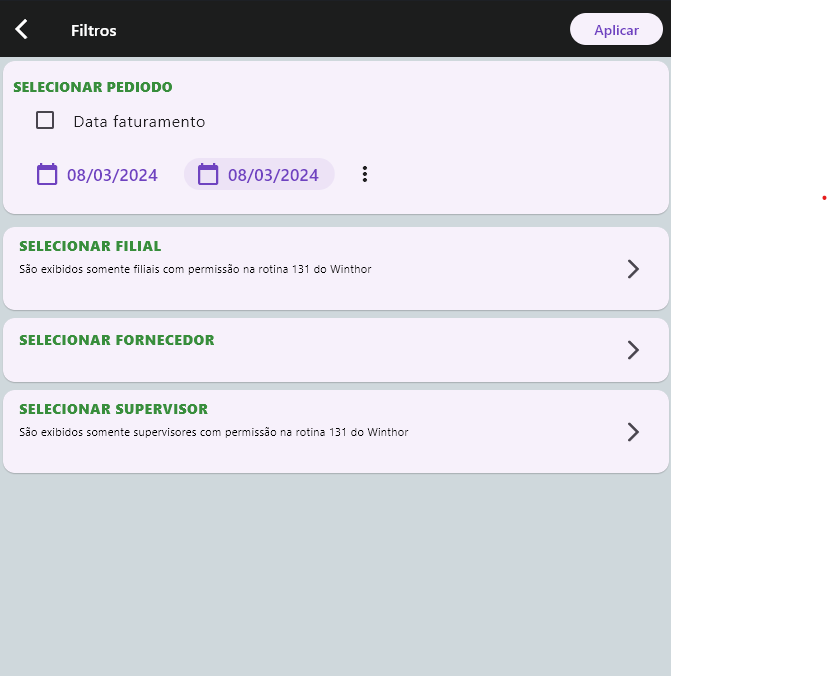

# Package Reports
Package de criação de relatórios automaticamente a partir de uma entrada de JSON
- Principais funções:
  - Relatório com totalizadores e ordenação
  - Gráficos (Barras, pizza, ...)
  - Exportação para excel

## Getting Started

- Entre no arquivo pubspec.yaml
- Adicione isto ao arquivo pubspec.yaml do seu pacote:
``` Dart
dependencies:
     package_reports: ^0.0.3
```
- Get dependencies

``` shell
flutter pub get
```

## Exemplo de 'cabeçalho' que arquivo .PHP que contém a query deve ter

- Para a ultilização dos filtros é necessario criar uma variavel que recebrá um array, esse array deve seguir o padrão imposto no exemplo abaixo, para receber esses
dados basta, ultilizar um requisição do tipo GET para o arquivo que deseja.

```php

    $menu               = 'Vendas'; // Menu que será exibido no aplicativos
    $submenu            = '';   //submenu se houver (OPCIONAL)
    $nomeDoArquivo      = 'query_teste_api.php'; //somente nome do arquivo + extensão
    $name               = 'Resumo de vendas (Por supervisor)'; // nome de apresentação no aplicativo

    $urlapi = "repositorio/reports/query/compras/";
    $config = [
        'menu'=> $menu,
        'submenu'=> $submenu,
        'urlapi'=> $urlapi.$nomeDoArquivo,
        'name'=> $name,
        'iconFlutterID'=> 'trending_up', // --> https://fonts.google.com/icons?selected=Material+Icons&icon.platform=flutter
        'graficosDisponiveis' => [
            'barras' => true,
            'linhas' => true,
            'circular' => true,
        ],
        'indexPage'=> 0,
        'selectedRow' => [],
        'filtros'=> [
            "cardPeriodo" => [
                "tipo" => "datapicker",
                "titulo" => "Selecionar pediodo"
            ],
            "cardFilial" => [
                "banco" => "atacado_analytics",
                "arquivoquery" =>"query_filtros.php",
                "funcao" => "getfilial",
                "tipo" => "checkbox",
                "titulo" => "Selecionar filial",
                "subtitulo" => "São exibidos somente filiais com permissão na rotina 131 do Winthor"
            ],
            "cardFornecedor" => [
                "banco" => "atacado_analytics",
                "arquivoquery" =>"query_filtros.php",
                "funcao" => "getFornecedor",
                "tipo" => "checkbox",
                "titulo" => "Selecionar fornecedor"
            ],
            "cardsupervisor" => [
                "banco" => "atacado_analytics",
                "arquivoquery" =>"query_filtros.php",
                "funcao" => "getSupervisor",
                "tipo" => "checkbox",
                "titulo" => "Selecionar supervisor",
                "subtitulo" => "São exibidos somente supervisores com permissão na rotina 131 do Winthor"
            ],
        ],

        'page' => [
            'menu'=> $menu,
            'submenu'=> $submenu,
            'urlapi'=> 'repositorio/reports/query/compras/sql1.php',
            'name'=> 'Resumo de vendas (Por rca)',
            'iconFlutterID'=> 'trending_up', // --> https://fonts.google.com/icons?selected=Material+Icons&icon.platform=flutter
            'indexPage'=> 1,
            'selectedRow' => [],
            'filtros'=> [
                "cardPeriodo" => [
                    "tipo" => "datapicker",
                    "titulo" => "Selecionar pediodo"
                ],
                "cardFilial" => [
                    "banco" => "atacado_analytics",
                    "arquivoquery" =>"query_filtros.php",
                    "funcao" => "getfilial",
                    "tipo" => "checkbox",
                    "titulo" => "Selecionar filial",
                    "subtitulo" => "São exibidos somente filiais com permissão na rotina 131 do Winthor"
                ],
            ],
        ]
    ];

    if ($_SERVER['REQUEST_METHOD'] === 'GET'){
        echo json_encode($config);
        exit;
    }
```

- Nessa nova versão do Package Reports é possivel criar relatorios dinamicos, se no 'cabeçalho' do arquivo conter 'page' significa que esse relatorio tem mais uma pagina de navegação, para criar relatorios dinamicos é aconcelhado a criação de uma pasta com todas as querys que esse relatorio terá, ao navegar para a proxima pagina do relatorio, a variavel dentro do array ```$config``` a chave 'selectedRow' será preenchida com um json com todos os valores da linha selecionada, no proximo arquivo apontado dentro de 'page' basta consumir qualquer item desse json para criar um filtro fixo em sua busca.

- Exemplo selectedRow:
```php
/* Ao clicar na linha que deseja será adicionado no body da busca o valor de selectedRow como o exemplo abaxio*/
/* selectedRow : {COD__INT__NO_METRICS: 0, NOME: UF - Vendedor , VLR_VENDA_LIQ: 280356.03, QTDE_CLIENTE_POSITIVADO__INT: 18}*/

$codsupervisor = $obj->selectedRow->COD__INT__NO_METRICS;

$sql = "SELECT CODSUPERVISOR 
        FROM PCSUPERV 
        WHERE 1=1 
        AND PCSUPERV.CODSUPERVISOR IN ($codsupervisor)";

```

- Para obter o retorno do relatorio dinamico, no arquivo principal (mesmo que contém o 'cabeçalho') é necessario uma pequena tratativa para executar as query informadas em cadas arquivo, lembrando que as que nesse tipo de relatorio os arquivos precisarão apenas da tratativa do selectedRow e a varevael que contém a quer:

```php

else{
        include_once "data_input_and_jwt_validation.php";
        $obj = get_data_input_and_jwt_validation();

        include_once "bd_instancia.php";
        
        switch($obj->indexPage){
            case 0:
                include_once "query_teste_api.php";
                $db     = instancia_DB($obj->database);
                $result = $db->select($sql);
                break;

            case 1:
                include_once "sql1.php";
                $db     = instancia_DB($obj->database);
                $result = $db->select($sql);
                break;
        }

        http_response_code(200);
        echo json_encode($result);
        exit;        
    }
```

- Ainda olhando para o arquivo principal o array $config contém uma chave chamada 'filtro' que deve seguir o padrão mostrado acima, é usado para gerar a pagina de filtro

### Pagina de Filtro:


- Caso o filtro seja do tipo checkbox é necessario informar o banco em que fará a busca, o arquivo e a função para essa busca, sendo assim o botão sera clicavel navegando para um tela a qual poderar selecionar o valores a serem filtrados:


## Exemplo de API para gerar JSON de entrada para o PACKAGE REPORTS

- Exemplo que como escrever uma query na API no back-end:
```php
<?php
    include_once "../header.php";
        
    if ($_SERVER['REQUEST_METHOD'] === 'POST') {
        $inputJSON = file_get_contents('php://input');
        $data = json_decode($inputJSON);
        if ($data === null) {
            http_response_code(400);
            echo json_encode(["error" => "Erro ao decodificar o JSON de entrada."]);
            exit;
        }

        // FAZER VERIFICAÇÕES DE ENTRADA DE CADA FILTRO
        if (!isset($data->data_inicio) || !isset($data->data_fim) || !isset($data->banco)) {
            http_response_code(400);
            echo json_encode(["error" => "Os campos 'data_inicio' e 'data_fim' são obrigatórios."]);
            exit;
        }
    } else {
        http_response_code(405);
        echo json_encode(["error" => "Método não permitido. Use POST para enviar os dados JSON."]);
        exit;
    }

    $sql =  "select 
                  pcpedc.codusur as cod__INT__NO_METRICS
                , pcusuari.nome
                , count(*) qtde_pedidos__INT
                , sum(pcpedc.vlatend) as total
            from pcpedc, pcusuari
            where pcpedc.codusur = pcusuari.codusur
            and data between to_date('$data->data_inicio', 'DD/MM/YYYY') and to_date('$data->data_fim', 'DD/MM/YYYY')
            group by pcpedc.codusur, pcusuari.nome
            order by total desc";

    $db = instancia_DB($data->banco);
    $result = $db->select($sql);

    http_response_code(200);
    echo json_encode($result);
    exit;
```

### exemplo de resquisição da API no Insonia:


### Saída JSON da query:
```json
    [
      {"COD__INT__NO_METRICS":"4321","NOME":"ADIL MENESES DOS SANTOS","QTDE_PEDIDOS__INT":"1","TOTAL":"487.37"},
      {"COD__INT__NO_METRICS":"2940","NOME":"ADMILTON MOREIRA SOUZA","QTDE_PEDIDOS__INT":"3","TOTAL":"1486.18"},
      {"COD__INT__NO_METRICS":"4318","NOME":"LUIZ FERRAZ DOS SANTOS","QTDE_PEDIDOS__INT":"1","TOTAL":"940.4"},
      {"COD__INT__NO_METRICS":"4307","NOME":"AGATINE OFLIA DE OLIVEIRA","QTDE_PEDIDOS__INT":"1","TOTAL":"1826.08"},
      {"COD__INT__NO_METRICS":"2","NOME":"FERREIRA DE OLIVEIRA","QTDE_PEDIDOS__INT":"3","TOTAL":"2802.86"}
    ]
```

- Tags permitidas para adição no alises da query
```dart
    /*
      Forma de realizar formatação de dados e alinhamento em tela.
      Deve-se enviar a seguinte informação no final de cada nome de coluna na query:

      __INT_STRING    => para forçar numero ser tratado e alinhado como string
      __STRING        => forçar o uso de String
      __DOUBLE        => forçar uso de double
      __INT           => forçar uso de int
      __NO_METRICS    => excluir da exibição de metricas dos graficos
      __NOCHARTAREA   => excluir do grafico de area e line
      __INVISIBLE     => não exibir campo no relatório
      __DONTSUM       => não somar na barra de totalizador
      __PERC          => colocar % (percentagem) junto ao texto da coluna
      __FREEZE        => congelar coluna ao deslizar barra de scroll horizontal
      __SIZEW         => passar largura fixa de coluna. Exemplo: __SIZEW300
      __LOCK          => Validar se o usuario tem acesso ao campo
      __ISRODAPE      => Usar para fazer um rodapé personalizado

      IMPORTANTE: coso o tipo de dado não seja informado, o tipo de formatação será identificado a partir dos dados recebidos
    */
```

### Relatório de saída:


### Relatório de saída - Gráficos:


### Relatório de saída - Exporte para Excel:


## Estrutura do package_reports
``` shell
lib-|
    |-- package_reports.dart 
    |       - Contém todos os exports permitidos para uso nos projetos que irão consumir o package
    |
    |-- report_module
    |   |
    |   |-- charts
    |   |   |-- chart_data.dart
    |   |   |       - ChartData (class de dados padrão que todos os graficos vão consumir)
    |   |   |       - ColorData (class com todas as cores para consumo randômico nos gráficos)
    |   |   '-- charts.dart
    |   |           - Widget de gráficos
    |   |
    |   |-- controller
    |   |   |-- layout_controller.dart
    |   |   |       - Controlador de largura, altura e tipo de tela (mobile, desktop)
    |   |   |-- report_chart_controller.dart
    |   |   |       - Controlador para construção de gráficos do relatório, keys com valores do tipo String será identificado com métricas e tipo int, double, será definido como valores dos gráficos
    |   |   |-- report_from_json_controller.dart
    |   |   |       - CONTROLADOR PRINCIPAL que irá receber o JSON de entrada para construção do relatório, todas as keys do JSON será interpretado como nome de coluna e todos os values das respectivas keys como rows de dados 
    |   |   '-- report_to_xlsx_controller.dart
    |   |   |       - Controlador para exportar dados para Excel
    |   |   '-- filtros_controller.dart
    |   |           - Controlador de filtros
    |   |
    |   |-- core
    |   |   |-- api_consumer.dart
    |   |   |       - Arquivo responsável pelo consumo de API que irá fornecer os dados em formato JSON para construção do relatório
    |   |   |-- features.dart
    |   |   |       - rercusos de uso privado no package (funções de formatação, etc)
    |   |   '-- settings.dart
    |   |           - variveis static global como link de api, etc
    |   |
    |   |-- model
    |   |   '-- my_icon_data.dart (442 KB)
    |   |
    |   |-- page
    |   |   |-- filtros_report_page.dart
    |   |   |       - Tela de filtros
    |   |   |-- report_chart_page.dart
    |   |   |       - Tela de gráficos
    |   |   |-- report_page.dart
    |   |   |       - Página de relatórios 
    |   |   '-- filtros_page.dart
    |   |           - class de conversão do filtro antigo do sistema analytics para atual
    |   |
    |   '-- widget
    |       |-- texto.dart
    |       |-- widgets.dart
    |       '-- xlsx_widget.dart
    |
    '-- version.dart
           - Versão do package
```
